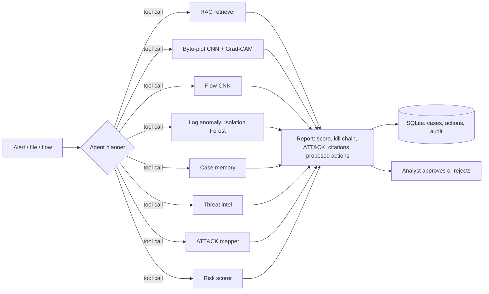

# AegisNexus

**An agentic, retrieval-augmented, CNN-powered security operations copilot.**
Alerts go in. An AI agent inspects the evidence, maps it to MITRE ATT&CK, scores the risk and proposes a response. A human approves every action.

[](https://github.com/Nikhil-creat/aegisnexus/actions/workflows/ci.yml)
**Live site:** https://nikhil-creat.github.io/aegisnexus/ (3D lab, author page)  
**Console demo:** https://nikhil-creat.github.io/aegisnexus/console.html (recorded data, runs entirely in the browser)

Built by Nikhil Chary Sriramoju. Defensive security only.

## What it combines

| Area | What is in the repo |
|---|---|
| **Agentic AI** | Tool-using investigator loop. Claude plans with tool use when `ANTHROPIC_API_KEY` is set; a deterministic offline planner runs otherwise. Guardrails: read-only tools, alert text treated as untrusted, step budget, mandatory core tools, actions only *proposed*. |
| **RAG** | Curated corpus of 34 MITRE ATT&CK techniques, OWASP categories and incident-response playbooks. TF-IDF retrieval with technique-ID lookup, source filters and citations in every report. Swappable for embeddings and a vector DB. |
| **CNN** | 2-D CNN classifies files rendered as 64x64 byte-plot images, with Grad-CAM heat-maps. 1-D CNN classifies 16-packet network flows. Both train on CPU during the Docker build. |
| **3D visualisation** | Three.js scenes on the site: an orbiting network of the agent and its tools that replays real investigations, a kill-chain ring with a risk column, and a byte-plot terrain that shows what the CNN looked at. Works with keyboard and screen readers through a component list, pauses off-screen, and respects reduced motion. |
| **Anomaly detection** | Isolation Forest fitted on a benign baseline flags rare activity windows (credential attacks, data exfiltration, off-hours use) and explains the top deviating features. |
| **Agent memory** | Recalls similar past cases from the case database (TF-IDF) and cites them in the report. |
| **Explainability** | Kill-chain coverage view, a "why this score" breakdown, Grad-CAM heat-maps and a full tool-by-tool evidence trail. |
| **Performance** | Agent steps stream to the browser over Server-Sent Events; duplicate alerts reuse a cached analysis; per-client token-bucket rate limiting. |
| **Observability** | Prometheus metrics at `/metrics` (optional Prometheus service in Compose), audit log, per-request timing, Markdown incident-report export. |
| **Full stack** | FastAPI backend, SQLite persistence, scrypt password hashing, HS256 tokens, role-based access (viewer, analyst, admin), audit log, login throttling, framework-free responsive dashboard. |
| **DevOps and supply chain** | Docker Compose, non-root containers, read-only filesystems, all Linux capabilities dropped, nginx CSP headers, GitHub Actions CI, CodeQL, Trivy image scan, Dependabot, GitHub Pages demo. |

## Architecture



## Quick start (Docker)

```bash
cp .env.example .env          # optional: set ADMIN_PASSWORD and ANTHROPIC_API_KEY
docker compose up --build     # trains the CNNs during the build (a few minutes on CPU)
# optional metrics UI:  docker compose --profile observability up -d   ->  http://localhost:9090
```

Open http://localhost:8080 and sign in as `admin`. If you left `ADMIN_PASSWORD` empty, the generated password is printed once:

```bash
docker compose logs api | grep "generated password"
```

## Run without Docker

```bash
cd backend
python -m venv .venv && source .venv/bin/activate      # Windows: .venv\Scripts\activate
pip install torch --index-url https://download.pytorch.org/whl/cpu
pip install -r requirements.txt
python -m app.cnn.train --out models                   # trains both CNNs
MODEL_DIR=models AUTH_REQUIRED=false uvicorn app.main:app --port 8000
# in another terminal, from the repo root:
python -m http.server 5500 --directory docs            # open http://localhost:5500/?api=http://localhost:8000
```

Without PyTorch the platform still runs on an explainable entropy and flow heuristic, so tests and the demo work anywhere.

## Tests

```bash
cd backend && pip install -r requirements-ci.txt && python -m pytest -q
```

Covers the byte-plot pipeline, both CNN classifiers, the anomaly model, case memory, streaming, the rate limiter, metrics, retrieval, threat-intel validation, the agent (including a prompt-injection alert), password hashing, token forgery (`alg: none`, tampering, expiry), the case lifecycle, role enforcement and upload limits.

## API

| Method and path | Role | Purpose |
|---|---|---|
| `GET /api/health` | public | Status, engines in use, whether auth is on |
| `POST /api/auth/login` | public | Exchange credentials for a token |
| `POST /api/investigate` | analyst | Run the agent on an alert and save the case |
| `POST /api/investigate/stream` | analyst | Same, streamed step by step (Server-Sent Events) |
| `GET /api/cases/{id}/report.md` | viewer | Download the case as a Markdown incident report |
| `GET /metrics` | internal | Prometheus metrics (not proxied by nginx) |
| `GET /api/cases`, `/api/cases/{id}` | viewer | Case history with full evidence trail |
| `POST /api/cases/{id}/actions/{i}` | analyst | Approve or reject a proposed action |
| `POST /api/analyze/file` | analyst | Classify an uploaded file (never executed) |
| `POST /api/analyze/flow` | analyst | Classify a 16x5 flow window |
| `POST /api/rag/search` | viewer | Query the knowledge base |
| `GET /api/stats`, `/api/metrics` | viewer | Dashboard numbers, model metrics |
| `POST /api/users`, `GET /api/audit` | admin | User management, audit trail |

Interactive docs at `/docs` on the API port when running locally (`http://localhost:8000/docs`).

## The website

| Page | What it is |
|---|---|
| `docs/index.html` | Professional landing page: 3D constellation, 3D threat lab, project summary, author and credentials |
| `docs/console.html` | The working console (recorded demo on GitHub Pages, live API in Docker) |
| `docs/assets/profile.js` | **Edit this one file** to change the name, links and certifications shown on the site |
| `docs/assets/scene3d.js` | The 3D scenes |

Three.js r128 loads from cdnjs. To serve it yourself (for a strict CSP or offline use), download `three.min.js` into `docs/assets/vendor/` and change the `<script src>` in `docs/index.html`; then remove the cdnjs host from `deploy/nginx.conf`.

## Project layout

```
backend/app/
  cnn/        bytemap, synthetic data, models, training, inference (+ heuristic fallback)
  ml/         Isolation Forest log-anomaly detector
  rag/        knowledge-base retriever
  agent/      tools, threat intel, case memory, Claude planner, orchestrator (cache, kill chain)
  data/       knowledge_base.json, intel.json, demo_alerts.json
  main.py     REST API          db.py, security.py   persistence, auth
  streaming.py, reporting.py, observability.py   SSE, Markdown export, metrics + rate limiter
docs/         static dashboard for GitHub Pages and for nginx in Docker
deploy/       nginx config
.github/      CI and optional Pages workflow
```

## Security design

* The agent has read-only tools. It cannot block, delete, isolate or execute anything.
* Alert text and file contents are untrusted. The prompt says so, tools validate inputs, and the UI escapes every value it renders.
* Risk score, severity and ATT&CK mapping come from deterministic tools, never from free-form model text.
* Model weights load with `torch.load(weights_only=True)`.
* Uploaded files are read as bytes only, with a size limit.
* Tokens are held in browser memory, not storage. Passwords use scrypt. Login is throttled.
* Requests are rate limited per client. `/metrics` is only reachable inside the Docker network.
* CodeQL, Trivy and Dependabot run in GitHub to catch code and dependency issues.
* Containers run as non-root with a read-only root filesystem and no capabilities.

See [SECURITY.md](SECURITY.md) for the threat model and known limits.

## Bring your own data

The bundled CNNs train on **synthetic, harmless** data, so their accuracy figures are integration checks, not benchmarks. For real use:

1. Byte-plot CNN: convert samples from Malimg or BODMAS with `app.cnn.bytemap.bytes_to_image`, replace `build_file_dataset`, and update `FILE_CLASSES`.
2. Flow CNN: build 16-packet windows from CIC-IDS2017 or UNSW-NB15 and replace `build_flow_dataset`.
3. Threat intel: replace `data/intel.json` with a MISP, OpenCTI or VirusTotal lookup in `agent/intel.py`.
4. Knowledge base: append entries to `data/knowledge_base.json` (same fields) and re-run `make demo-data`.

## Refresh the Pages demo with the trained CNNs

The committed `docs/data/` was recorded with the heuristic engine. After `docker compose up --build`, run `make demo-data` (Linux, macOS or WSL), commit `docs/data/`, and push.

## Roadmap

Embedding-based retrieval, Postgres, live log ingestion (syslog, Wazuh, Suricata), SOAR connectors behind the approval gate, model-drift monitoring, adversarial-robustness testing of the CNNs.

MIT licensed.

## Author

**★NIKHIL CHARY SRIRAMOJU★**
BTech CSE (Final Year)

- GitHub: [Nikhil-creat](https://github.com/Nikhil-creat)
- LinkedIn: [nikhil-chary-sriramoju](https://in.linkedin.com/in/nikhil-chary-sriramoju-95041b38a)
- Email: sriramojunikhil66@gmail.com
- Instagram: [@nikhil__sriramoju](https://www.instagram.com/nikhil__sriramoju)
- Facebook: [Profile](https://www.facebook.com/profile.php?id=100079201124141)

  
